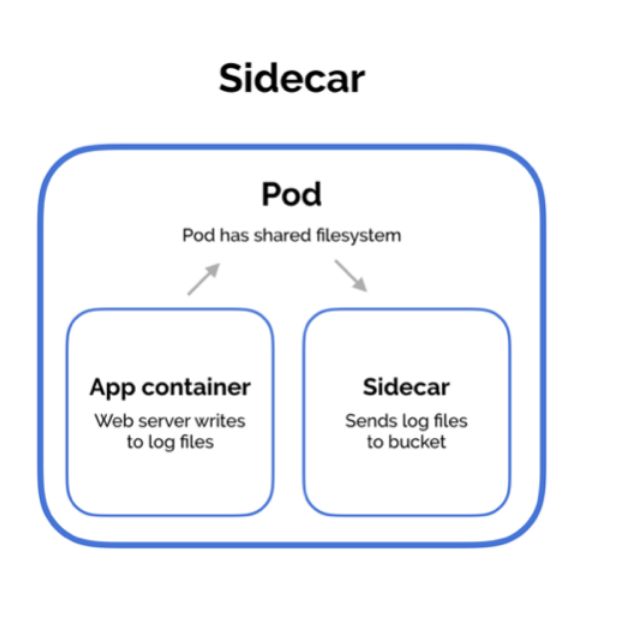

# **Open Policy Agent**
---
# Overview
Decouples access control policy **decision making** from **enforcement** 


---
# Why decouple?
1. Different apps can have a common language/platform to specify their access control policy
1. You can update your access control policy without restarting your application
---
# Why OPA?
1. Rego provides a declarative syntax when it comes to specifying your policy

```
// Show some rego syntax
```
---
# Demo with VSCode
Query & Policy 


---
# KMO Recap
For each resource, there's owner team, collaborator teams, etc... (ACL of the resource)

A user can be part of many teams. These teams will be matched against the ACL to see if the user has access.

---
# How will it be done?
In KMO, each resource is tied to an API endpoint (except for some). 

For each access via the API endpoint, **Query** , and supply ACL for a **Decision** 


--- 
# Demo with Spring Security
1. Show unsecured access to resource
1. Show database information
1. Secure the application, explain AccessDecisionManager & Voter
1. Login with unauthorised user
1. Open OPA container logs 
`docker logs <CONTAINER_NAME> 2>&1 >/dev/null | jq '.'`
1. Login with authorised user
1. Show tests

---
# Deployment
Sidecar Pattern in Kubernetes

